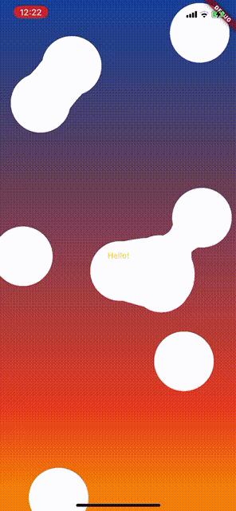

# Simple Metaballs

Name is a bit tongue-in-cheek. I don't feel it's simple because I don't have a great understanding of it yet.

## What

Metaballs is a visual effect that looks a lot like blobs of wax moving around in a lava lamp.

## Where

Most of the interesting code is in opacity_filter.dart and opacity_filter.frag.

## How

Uses flutter_shaders add-on from https://pub.dev/packages/flutter_shaders (tested with 0.1.2)

- Draws some circles in a Stack with an opaque center, and a gradient to transparent on the outside.
- Pass the Stack to a fragment shader that deletes all pixels that are too transparent
- Shader finally takes all pixels that are remaining, and makes them fully opaque
- Animation moves circles around
- When the underlying combined opacity value between circles is over the threshold, it creates a "link" between them

Not sure if that is clear. 

## Who: 
Me: twitter.com/d2dev_
